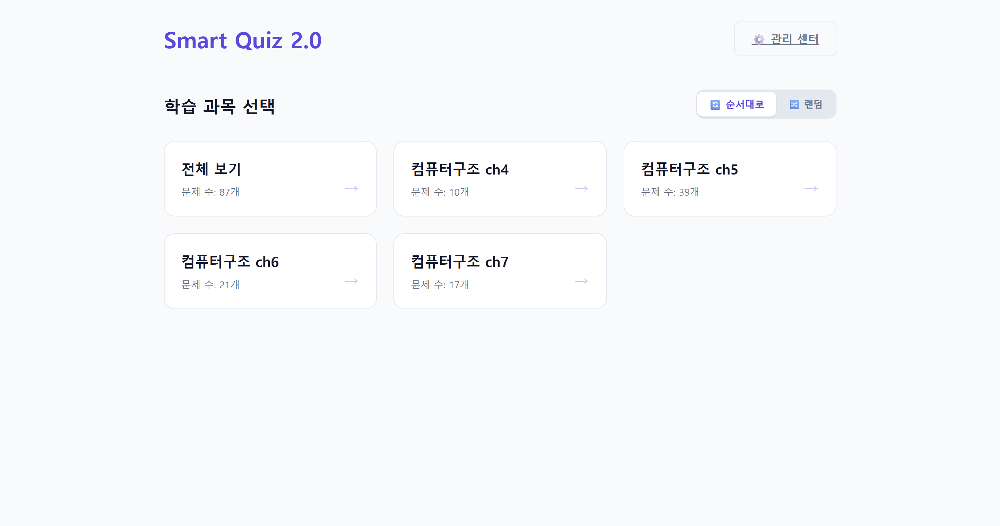
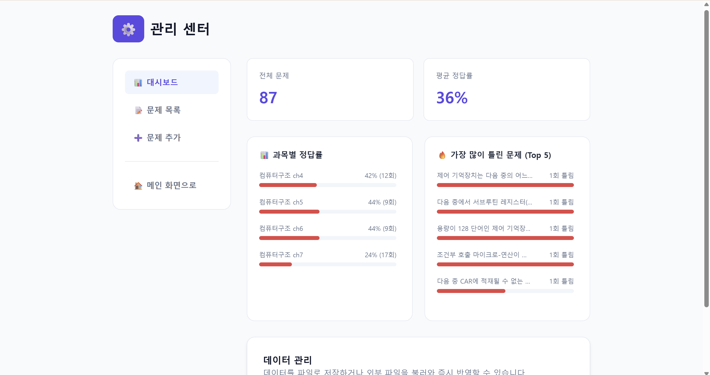

# Smart Quiz 2.0

중간고사 오답을 노트에 다시 적는 시간을 줄이기 위해 만든 브라우저 기반 문제 풀이 도구입니다.

[시연 영상](https://youtu.be/7IYJT-ylpwU)



## 만들게 된 이유

중간고사를 준비하며 틀린 문제를 노트에 적고 다시 푸는 방식으로
공부했습니다. 오답이 쌓이자 문제와 보기를 옮겨 적는 시간이 길어졌고,
정작 다시 풀어보는 데 쓸 시간이 줄었습니다.

대신 사용할 앱과 웹 서비스를 찾아봤지만 원하는 방식과 맞는 것을 찾지
못했습니다. 시험 기간에는 서버나 완성도 높은 서비스보다 지금 바로 실행할
수 있는 도구가 중요했기 때문에 HTML, CSS와 JavaScript로 직접 만들었습니다.
첫 실행 버전부터 2.0까지의 주요 커밋은 2026년 4월 18일 하루 동안
작성되었습니다.

문제 데이터는 당시 공부하던 김종현의 『컴퓨터구조』 개정 6판 예제를
바탕으로 개인 학습용으로 정리했습니다. 완성한 앱은 직접 사용하고 같은 과
동기와 당시 여자친구에게도 공유했습니다.

## 주요 기능

- 전체 문제 또는 과목별 문제 선택
- 순차 풀이와 랜덤 풀이
- 객관식과 복수 정답을 허용하는 단답형 문제
- 제출 후 정답률과 틀린 문제 확인
- 문제별 맞힌 횟수와 틀린 횟수 저장
- 과목별 정답률과 가장 많이 틀린 문제 표시
- 이미 아는 문제를 출제 대상에서 끄는 활성화 스위치
- 문제 추가, 수정, 삭제와 같은 과목 안에서의 순서 변경
- 수정한 문제 데이터를 `data.js` 파일로 내보내기

## 관리 센터



문제를 풀면 맞힌 횟수와 틀린 횟수가 브라우저의 `localStorage`에 저장됩니다.
관리 센터에서는 이 기록을 이용해 전체·과목별 정답률과 오답이 많은 문제를
확인합니다.

문제 관리 기능은 별도의 데이터베이스를 사용하지 않습니다. 관리 화면에서
변경한 내용은 실행 중인 브라우저 메모리에 반영되고,
`data.js 파일로 내보내기`를 누른 뒤 기존 파일을 교체해야 다음 실행에서도
유지됩니다. 화면에 남아 있는 `데이터베이스에 저장 (임시)` 버튼 문구는 서버
연결을 고려했던 초기 흔적이며, 실제 데이터베이스 저장 기능은 구현되어 있지
않습니다.

## 실행 방법

별도의 빌드 과정은 없습니다. 저장소 루트에서 정적 파일 서버를 실행합니다.

```bash
python -m http.server 8000
```

- 문제 풀이: <http://localhost:8000>
- 관리 센터: <http://localhost:8000/assets/pages/admin.html>

브라우저에서 `index.html`을 직접 열 수도 있지만, 모듈과 파일 경로가 브라우저
정책의 영향을 받지 않도록 로컬 HTTP 서버 사용을 권장합니다.

## 데이터 구조

문제는 `data.js`의 `quizData` 배열에 저장합니다.

```js
{
  id: 1,
  category: "컴퓨터구조 ch4",
  question: "질문 내용",
  type: "multiple",
  isActive: true,
  options: ["보기 1", "보기 2", "보기 3", "보기 4"],
  answer: 0
}
```

- `type`: `multiple`은 객관식, `short`는 단답형입니다.
- `isActive`: `false`인 문제는 학습 화면에 나오지 않습니다.
- 객관식 `answer`: 정답 보기의 0부터 시작하는 인덱스입니다.
- 단답형 `answer`: 문자열 또는 허용할 여러 정답의 배열입니다.

## 프로젝트 구조

```text
.
├── assets/
│   ├── css/style.css
│   ├── js/
│   │   ├── admin.js
│   │   └── app.js
│   └── pages/admin.html
├── docs/images/
├── data.js
├── index.html
└── README.md
```

## 현재 범위와 한계

- 회원가입과 로그인 기능이 없습니다.
- 문제와 통계가 서버에 저장되거나 다른 기기와 동기화되지 않습니다.
- 통계는 현재 브라우저의 `localStorage`를 지우면 함께 삭제됩니다.
- 관리 화면에서 바꾼 문제는 `data.js`를 내려받아 직접 교체해야 합니다.
- 여러 사람이 동시에 사용하는 온라인 학습 서비스가 아니라 개인용 로컬 도구에 가깝습니다.

이 프로젝트에서는 서버 구축보다 시험공부에 당장 사용할 수 있는 상태를
우선했습니다. HTML과 JavaScript만으로 빠르게 실행할 수 있다는 점이 가장 큰
장점이었고, 데이터가 한 노트북 안에 머문다는 점이 동시에 가장 큰
한계였습니다.
